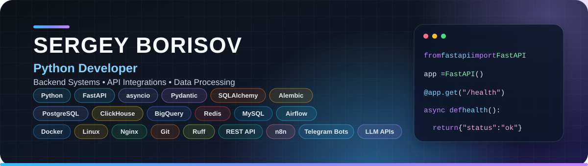

  

## About me

I develop backend services, asynchronous API clients, data pipelines and automation tools. I enjoy turning external APIs and complex business processes into reliable, maintainable systems.

## Tech stack

### Backend

### Databases & Data

### Infrastructure, APIs & Automation

## Current interests

Backend architecture, API integrations, data-intensive applications, developer tools and AI automation.

## GitHub activity

<picture>
  <source media="(prefers-color-scheme: dark)" srcset="https://raw.githubusercontent.com/dcierra/dcierra/main/profile-summary-card-output/github_dark/0-profile-details.svg">
  <source media="(prefers-color-scheme: light)" srcset="https://raw.githubusercontent.com/dcierra/dcierra/main/profile-summary-card-output/github/0-profile-details.svg">
  
</picture>

  

  <picture>
    <source media="(prefers-color-scheme: dark)" srcset="https://raw.githubusercontent.com/dcierra/dcierra/main/profile-summary-card-output/github_dark/3-stats.svg">
    <source media="(prefers-color-scheme: light)" srcset="https://raw.githubusercontent.com/dcierra/dcierra/main/profile-summary-card-output/github/3-stats.svg">
    
  </picture>
  <picture>
    <source media="(prefers-color-scheme: dark)" srcset="https://raw.githubusercontent.com/dcierra/dcierra/main/profile-summary-card-output/github_dark/1-repos-per-language.svg">
    <source media="(prefers-color-scheme: light)" srcset="https://raw.githubusercontent.com/dcierra/dcierra/main/profile-summary-card-output/github/1-repos-per-language.svg">
    
  </picture>

  

  

